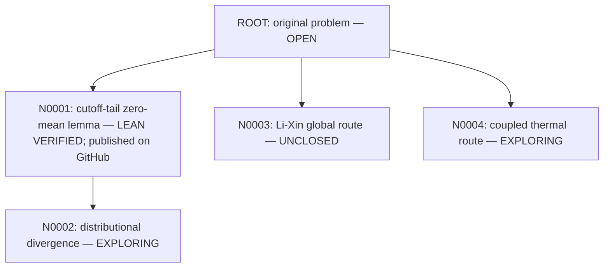

# xiong-fns-general-vacuum

Research towards small-physical-energy global strong solutions of the two-dimensional full compressible Navier–Stokes system with heat conduction and far-field vacuum.

**The global theorem is OPEN.** This repository records exact proof scopes, failed attempts, and actual Lean evidence. A passed general lemma does not certify its application to the PDE.

## Research tree

- [Problem and workflow](AGENTS.md)
- [Node N0001: exact target](notes/nodes/N0001/statement.md)
- [Claim ledger](notes/claims.md)
- [Machine-readable tree](notes/tree.json)

Each proof node must pass Lean build, transitive-axiom inspection and semantic review before its branch can extend. Failed nodes remain visible. Publication must include all certificate-bound files and the full dependency closure. The private [GitHub repository](https://github.com/SongXin2357/xiong-fns-general-vacuum) is active; [N0001 publication receipt](evidence/N0001/github-initial-publication.json) records full byte-for-byte remote readback.

## First verified node

N0001 uses actual Lebesgue integrals and two dominated-convergence arguments. [Lean source](lean/FNSTree/N0001.lean), [certificate](evidence/N0001/certificate.json), [independent proof](notes/nodes/N0001/independent-proof-20261006.md), [semantic review](notes/nodes/N0001/semantic-review-20261006.md), [red-team](notes/nodes/N0001/redteam-20261006.md).

The exact-target file is the immutable preregistration snapshot: its initial exploring / Lean NOT_RUN line records the status before proof work. Current status is recorded in the claim ledger, tree registry and certificate above.

N0002 is an unverified child; N0003 is an independent open global target. No PDE application is certified. N0001 is published at [commit 8211cef](https://github.com/SongXin2357/xiong-fns-general-vacuum/commit/8211cef495fded145823cfeedd35464ee7a18e6f). Its branch may extend only after the current evidence and publication gate passes.

[English TeX note](manuscript/cutoff_cancellation.tex) · [Compiled PDF](manuscript/cutoff_cancellation.pdf) · [Reproduction](REPRODUCE.md)
