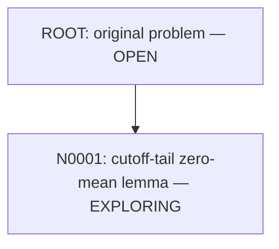

# xiong-fns-general-vacuum

Research towards small-physical-energy global strong solutions of the two-dimensional full compressible Navier–Stokes system with heat conduction and far-field vacuum.

**The global theorem is OPEN.** This repository records exact proof scopes, failed attempts, and actual Lean evidence. A passed general lemma does not certify its application to the PDE.

## Research tree

- [Problem and workflow](AGENTS.md)
- [Node N0001: exact target](notes/nodes/N0001/statement.md)
- [Claim ledger](notes/claims.md)
- [Machine-readable tree](notes/tree.json)

Each proof node must pass Lean build, transitive-axiom inspection and semantic review before its branch can extend. Failed nodes remain visible. GitHub publication awaits local CLI authentication.
